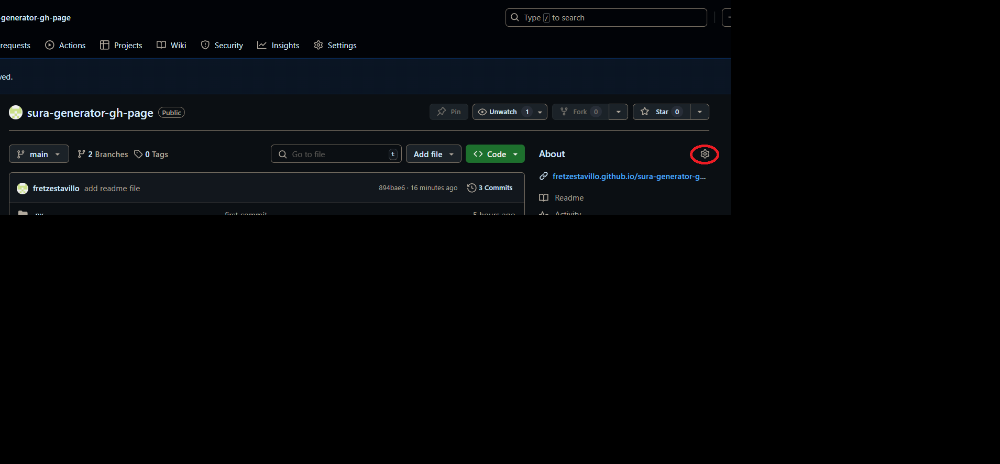
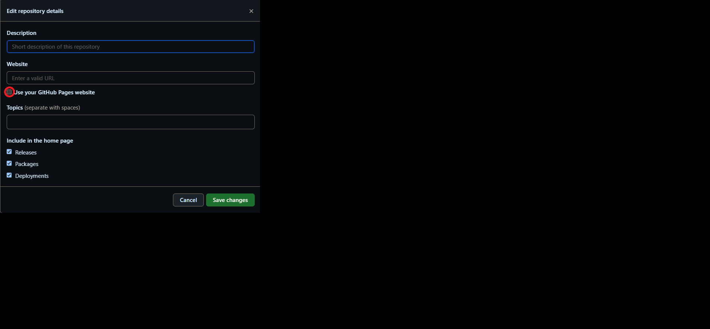
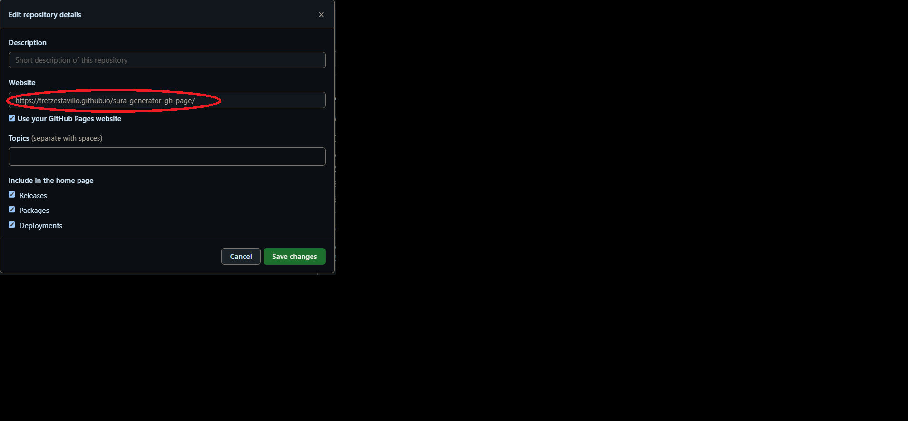

# Sura Generator

This project is for you able to pick random dish in your daily life

## Getting Started

To set up the project, follow these steps:

1. Clone the repository:

```bash
git clone https://github.com/fretzestavillo/sura-generator-gh-page.git
```

2. Change Directory:

```bash
cd sura-generator-gh-page.git/
```

3. Remove the existing git:

```bash
rm -rf .git
```

4. Install the dependencies

```bash
npm install
```

<ul>

<li>Create new repository in your github, once created get your repository name because this important later. repository name example: `sura-generator` https://github.com/fretzestavillo/<strong>sura-generator-gh-page</strong> </li>

<li>Now go to folder apps/web and find webpack.config.js</li>
<li>Open webpack.config.js then change the `sura-generator` with your repository name and then save.
   `process.env['NODE_ENV'] === 'production' ? '/sura-generator-gh-page/' : '/',` </li>
<li>Now it's time to connect local repository into remote repository </li>
<li>Run the following command </li>

</ul>

```bash
Note: replace this 'https://github.com/fretzestavillo/sura-generator-gh-page.git' with your own repository that created earlier.

git init
git add .
git commit -m "first commit"
git branch -M main
git remote add origin https://github.com/fretzestavillo/sura-generator-gh-page.git
git push -u origin main
```

## Development

```bash
npm run dev
```

5. Open your web browser and navigate to `http://localhost:4200/` to see the application running.

## Deployment

```bash
 npm run deploy
```

## Hosting website

```
Go to your github and click the settings
```



```
Then click the check box and save
```



```
You can now click the link to view the website hosted by github
```


